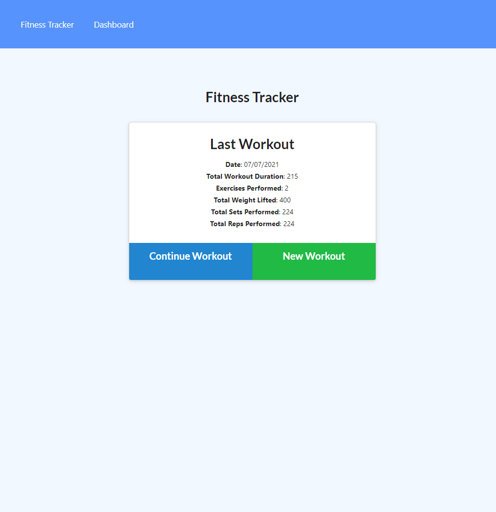

# Fitness and Workout Tracker

## Licence

## Description

My motivation for this project was: to track my workouts, helping me stay healthy and active.

I built this project because as a programmer I spend a lot of time sat down at a desk, stationary. What better way to help me get out of my chair than build an app to track my workouts for me. Now I know exactly how much time i have spend exercising every day!.

This project solves the following problem a.

From this project I learnt I learnt noSQL, how different it is to SQL and how you must view the same problem from a different angle to solve it.

## Live Link

[Here](https://warm-badlands-74001.herokuapp.com/) you can find the deployed application.

## Screenshot

## Contents

-   [Installation](#installation)
-   [Licence](#licence)
-   [Features](#features)
-   [Contributions](#contributions)
-   [Questions](#questions)

## Features

-   noSQL.
-   Mongoose.
-   MongoDB app.
-   Express js.

## Dependencies

To install dependencies run:
`npm i`

## Testing

To run tests use the command:
`no tests for this project`

## Contributions

Send me an email with recommendations.

## Questions

-   Contact me via [GitHub](https://github.com/lewy192)
-   Contact me via [Email](mailto:lewis.james.hill@outlook.com)

## Acknowledgements

-   [w3schools](https://www.w3schools.com/)
-   [StackOverflow](https://stackoverflow.com/)
